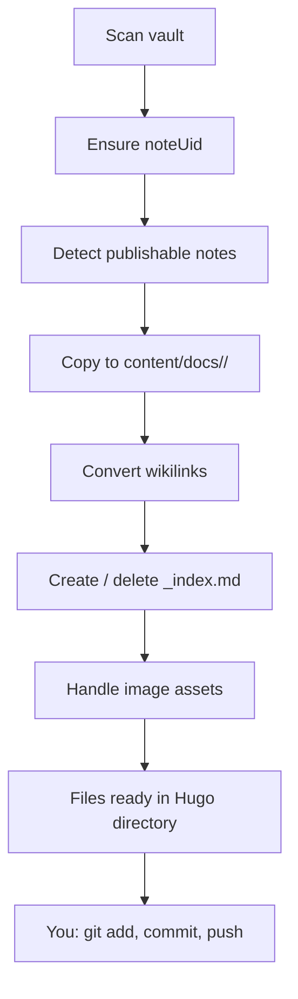

# 📄 Obsidian → Hugo Sync Daemon (Go)

**Concise Project Requirements · Lotus Docs-ready**

## Project Overview (Non-Technical)

Imagine autosave for your website: whenever you place a special tag (`publish: true` or `#publish`) on a note in Obsidian, that note shows up—beautifully formatted—in your local Hugo site directory. Remove the tag and the page disappears. You handle Git commits and pushes when ready. No command-line gymnastics, no copy-pasting between apps—just write, tag, and the daemon keeps your Hugo content in sync.

### What Problems Does It Solve?

- **Zero manual exporting** — one workspace (Obsidian) powers both your private notes and your public docs
- **No broken links** — links are converted only when the target note is also published
- **You control Git** — files are copied to Hugo directory, you handle commits/pushes when ready
- **Automatic clean-up** — un-publish a note and its page, plus any now-empty section, vanishes automatically

---

## 1. Purpose

- Keep your Obsidian vault and a Hugo site directory in sync
- Every note gets a stable `noteUid`
- Notes marked publishable (`publish: true` or `#publish`) are copied to Hugo content directory
- A folder/section is published only while it contains at least one publishable note
- **You handle Git operations** — daemon only manages file copying
- **Process isolation** — daemon creates `.obsidian-hugo-sync.lock` with PID; graceful shutdown removes it; startup fails if active PID found

---

## 2. High-Level Workflow



---

## 3. Key Rules & Defaults

| Topic | Rule |
|-------|------|
| **Publish flag** | `publish: true` or `#publish` tag |
| **Folder publish** | Folder live ↔ at least 1 publishable note |
| **Section file** | `_index.md` auto-generated / removed (never stored in vault) |
| **Wikilinks** | `[[Note]]` → `relref` only if target publishable; else plain text |
| **Weights** | Auto-assign: folders = 100×(depth+1), notes = folder_weight + (10×alphabetical_index) |
| **Cache** | Versioned JSON at `~/.config/obsidian-hugo-sync/{vault-hash}/state.json` (Linux), `~/Library/Application Support/...` (macOS), `%APPDATA%\...` (Windows) |
| **Change detection** | Content hashes (SHA256) + file modification times + UID tracking |
| **File tracking** | Moved/renamed files tracked by `noteUid`, not path |
| **Performance** | Optimized for efficiency with incremental processing |
| **Scope** | Content-only sync (Hugo config and Git handled separately) |

---

## 4. State Management Schema

### Cache Structure (`state.json`)
```json
{
  "version": "1.0",
  "vault_hash": "abc123def456",
  "notes": {
    "note-uid-12345": {
      "source_path": "Guides/SEO Basics.md",
      "hugo_path": "content/docs/guides/seo-basics.md", 
      "last_modified": "2024-01-15T10:30:00Z",
      "last_sync": "2024-01-15T10:30:05Z",
      "published": true,
      "content_hash": "sha256-abc123def456"
    }
  },
  "images": {
    "guides/screenshot.png": ["note-uid-12345", "note-uid-67890"]
  }
}
```

### Change Detection Logic
- **Content changes:** Compare SHA256 hash of file content
- **Rename/move detection:** Match by `noteUid` in front-matter, update paths
- **Publish state changes:** Track `publish: true/false` and `#publish` tag changes
- **Cache invalidation:** Rebuild if version mismatch or corruption detected

---

## 5. File & Path Mapping

**Vault:** `Guides/SEO Basics.md`  
**Hugo:** `content/docs/guides/seo-basics.md`  
**URL:** `/docs/guides/seo-basics/`

*Root-level notes fall back to `content/docs/posts/`.*

### Conflict Resolution
**Slug collision:** If multiple notes generate same slug (e.g., `seo-basics.md`), append `-{noteUid[0:8]}` to duplicates.  
**Deep nesting:** Paths >5 levels deep flatten to `content/docs/{folder1}-{folder2}-{etc}/note.md`  
**Long paths:** Slugs >50 chars truncate with `-{noteUid[0:8]}` suffix

### Image Handling

**Vault:** `Guides/images/screenshot.png`  
**Hugo:** `content/docs/guides/images/screenshot.png`  
- **Copy trigger:** Images copied when `` or `![[filename]]` found in published notes
- **Cleanup logic:** 24h grace period after last published reference removed (protects against temporary unpublish)
- **Reference tracking:** Daemon maintains image→notes mapping; deletes when mapping empty
- **Supported formats:** `.png`, `.jpg`, `.jpeg`, `.gif`, `.svg`, `.webp`

---

## 6. Link Tracking & Wikilink Conversion

### Core Processing Rules
- **Slug map rebuilt every cycle** → the daemon records every current publishable note as `folder/slug`
- **During copy each `[[wikilink]]` is looked up:**
  - **Hit** → `[text]()` (or Markdown link if `--link-format=md`)
  - **Miss** → `text` (plain) or `text` linked to `#` when `--unpublished-link=hash`
- **Automatic downgrade/upgrade** — if a target note is later un-published, next sync converts the link back to plain text; when a target becomes publishable the link upgrades to a real URL
- **Guarantee** — A Hugo build can never introduce an internal 404

### Advanced Link Patterns
```markdown
[[Note]]                    → [Note]()
[[Note|Custom Text]]        → [Custom Text]()
[[Note#Section]]            → [Note]() (Hugo handles sections)
[[../Other Folder/Note]]    → Resolve relative paths to absolute vault paths first

# Skip processing in code blocks
```markdown
[[Not processed]]
```

# Skip processing in inline code
`[[Not processed]]`
```

### Implementation Notes
- **Custom display text:** Extract `|Custom Text` and use as link text
- **Section links:** Ignore `#Section` part (Hugo's relref handles navigation)
- **Relative paths:** Normalize `../` paths relative to current note's folder
- **Code block detection:** Skip wikilinks inside ` ``` ` blocks and `` `inline` `` code

---

## 7. Front-Matter Mutations

### YAML Processing Rules
- Insert `noteUid` (UUID v4) first if missing
- Insert `weight` only when `--auto-weight` (default on) and user hasn't set it
- **Respect user weights:** If user sets `weight: 50`, preserve it (don't auto-assign)
- **YAML support:** Basic strings, numbers, booleans, arrays, multi-line (keep simple)
- **Error handling:** Malformed YAML → clear error message, skip file until fixed
- **Tag processing:** Support both `publish: true` in front-matter and `#publish` in tags array
- Nothing else is modified

### Example Processing
```yaml
---
# Before (user file)
title: "SEO Guide"
tags: [seo, #publish, marketing]
weight: 75
---

# After (daemon processing)  
noteUid: 12345678-abcd-ef90-1234-567890abcdef
title: "SEO Guide"
tags: [seo, #publish, marketing]
weight: 75  # User weight preserved
---
```

---

## 8. Configuration Management

### CLI Flags (Minimum Set)

| Flag | Default | Notes |
|------|---------|-------|
| `--vault` | — | Path to vault (required) |
| `--repo` | — | Path to Hugo site directory (required) |
| `--content-dir` | `content/docs` | Target docs dir |
| `--auto-weight` | `true` | Disable to manage weights yourself |
| `--link-format` | `relref` | `relref` = ``, `md` = `[text](/docs/path/)` (static Hugo URLs) |
| `--unpublished-link` | `text` | `hash` to link `#` instead |
| `--interval` | `30s` | Scan interval if fsnotify off |
| `--log-level` | `info` | `debug`, `info`, `warn`, `error` |
| `--dry-run` | `false` | Preview changes without writing files |

*All other advanced flags remain available; see README once built.*

### Configuration File Support
```toml
# ~/.config/obsidian-hugo-sync/config.toml
[default]
vault = "/path/to/vault"
repo = "/path/to/hugo/site" 
content_dir = "content/docs"
auto_weight = true
link_format = "relref"
log_level = "info"
```

### Configuration Rules
- **File location:** Same directory as cache: `~/.config/obsidian-hugo-sync/config.toml`
- **Precedence:** CLI flags override config file values
- **MVP scope:** Single profile only (no multi-vault support initially)
- **Validation:** Clear error messages for invalid config values

---

## 9. Error Handling & Recovery

### Cache Management
- **Corruption detection** — Validate `state.json` on startup; rebuild if corrupted
- **Cache versioning** — Migrate cache format automatically for future updates
- **Fallback strategy** — Full vault rescan if cache is missing or invalid

### File Operations
- **Permission denied** → Check file/directory permissions, suggest solutions
- **Path validation** → Verify vault and Hugo directories exist and are accessible
- **File existence checks** → Before deleting files, verify they actually exist
- **Error recovery:**
  - Auto-restart after recoverable errors (temporary permission issues, disk space)
  - Corrupted cache state → rebuild from scratch
  - Invalid file paths → skip with warning, continue processing

### User Feedback
- **Clear error messages** — Specific guidance when operations fail
- **Dry-run mode** — Test configuration and preview changes before writing files
- **Logging levels** — Configurable verbosity for debugging

---

## 10. Git Workflow (Manual)

The daemon **only handles file synchronization**. You manage Git operations yourself:

### Typical Workflow
```bash
# 1. Start the daemon
obsidian-hugo-sync --vault ./vault --repo ./hugo-site

# 2. Edit notes in Obsidian, tag with #publish

# 3. Daemon automatically copies files to Hugo directory

# 4. When ready, commit and push manually:
cd /path/to/hugo-site
git add .
git commit -m "Update docs: added new SEO guide"
git push origin main

# 5. Deploy however you normally deploy (Netlify, GitHub Pages, etc.)
```

### Why Manual Git?
- **Full control** — You decide when changes go live
- **Flexible workflow** — Batch multiple changes, add custom commit messages
- **Safer** — No accidental commits or network issues during writing
- **Simpler** — No Git credentials, branches, or authentication complexity

---

## 11. Performance Targets & Monitoring

| Metric | Target | Notes |
|--------|---------|-------|
| **Startup time** | <2s for 1000 notes | Includes cache validation |
| **Incremental sync** | <300ms single note | File change → Hugo file written |
| **Memory baseline** | <30MB idle | <100MB during full vault scan |
| **Batch processing** | 50 notes/second | Publishing large note sets |
| **Cache rebuild** | <10s for 1000 notes | When state.json corrupted/missing |

*Note: Performance targets are guidelines; focus on stability over micro-optimizations.*

### Monitoring & Observability
- **Structured logging:** Use Go's `log/slog` with configurable levels
- **Dry-run mode:** Show detailed file operations without writing
- **Status reporting:** Log sync summaries: "Processed 5 files, 2 published, 1 unpublished"

---

## 12. Tech Stack & File Watching

- **Go** ≥ 1.21
- **File watching strategy:**
  - Primary: fsnotify with recursive vault monitoring
  - Fallback: 30-second polling when fsnotify fails (network drives, >8192 files on Linux)
  - Batch processing: collect simultaneous file changes, process atomically
  - No debouncing: ignore rapid typing changes, rely on periodic scans
- **yaml.v3, uuid, sha256**
- **log/slog** for structured logging

---

## 13. Testing Strategy

### Test Scope & Environment
- **Primary target:** Linux (MVP focus)
- **Unit tests:** Mock fsnotify and file system interactions
- **Integration tests:** Real vault and Hugo directory interactions
- **Test isolation:** Create temporary vaults and Hugo directories for each test
- **Cross-platform:** Future consideration, Linux-first approach

---

## 14. Acceptance Tests

- UIDs added everywhere, no duplicates across vault
- Folder appears when first note published; disappears when last unpublished
- Zero broken internal links in Hugo content (comprehensive link validation)
- Deleting `state.json` triggers rebuild without duplicate content
- Daemon restart resumes work without duplicating files
- Images correctly copied and cleaned up (24h grace period respected)
- File existence properly checked before deletion attempts
- All error scenarios fail gracefully with actionable messages
- Dry-run mode accurately previews all changes without side effects
- Performance targets met under normal and stress conditions

---

## 15. Post-MVP Ideas

- Hugo server integration (auto-restart on content changes)
- Netlify Deploy Preview integration
- Slack/Discord notifications for sync events
- BoltDB cache for >50MB vaults
- Cross-platform binaries & Homebrew tap
- Watch for Hugo config changes and auto-restart
- Optional Git integration (restore automatic commits as opt-in feature)

---

**END – PRD v13-file-sync-only**